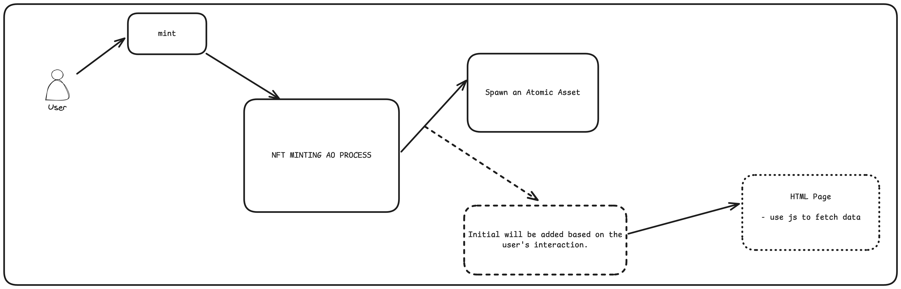

# Dynamic Atomic Assets

https://dynamic-aa.vercel.app

## TODOs

- [x] Create an HTML page which is fetching data from any api and updating as the data updates.
- [x] Upload the HTML page to arweave use ardrive
- [x] Test the loading of HTML page directly on arweave gateways
- [x] Format the HTML page as per the data to attach it to the process while spawnning.
- [x] Create a simple webpage accepting user Arweave Wallet Address and spawn an personalised Atomic Asset.
